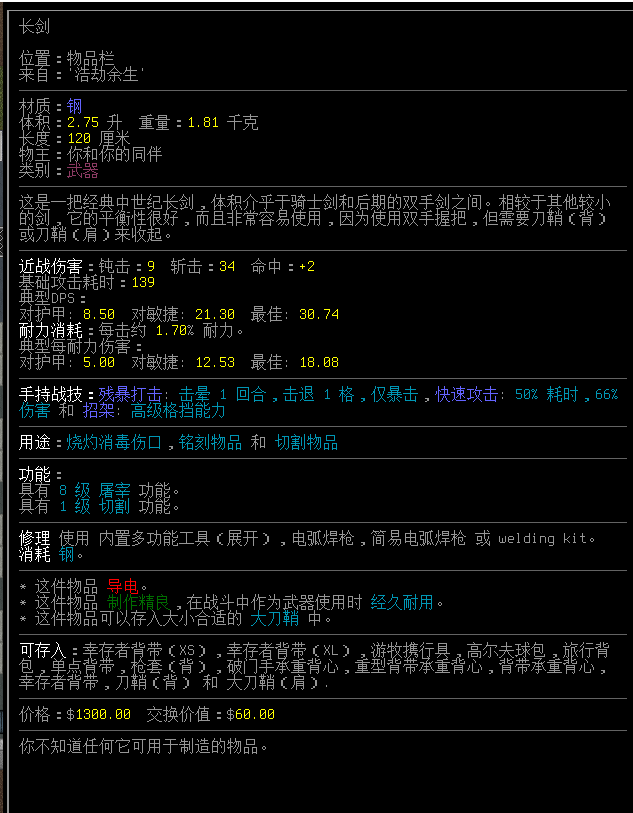

# 攻击与防御机制解释

### 近战机制及基本概念

**近战攻击：**当你尝试向敌对目标所在格移动，或相邻格有敌人时按下TAB即可发动近战攻击；

**攻击耗时：**近战攻击消耗的行动点数（通常称为攻击耗时）受躯干累赘与武器数据影响，武器数据通常受武器本身的重量、体积影响；

**命中：**你所拥有的近战技能与武器技能、武器数据加成、流派带来的命中加成将联合对抗敌人的闪避技能以决定是否命中敌人。

通常来说小体积敌人更难命中，而大体积敌人更容易命中；

**伤害：**玩家命中后的伤害取决于技能等级加成与武器数据，伤害将受到敌人护甲减免，如伤害被减免至零或更低，则会出现无法穿透护甲的情况；

**敌对单位的伤害：**你的敌人需要使用自身近战技能对抗你的闪避技能以决定是否命中；如果命中，则随机决定命中哪个部位并投掷该单位的伤害骰以确定其所造成的伤害；

敌人命中后所造成的伤害取决于其内部数据给予的伤害骰，通常以XdX+X为主，代表投掷X枚X面的骰子，+X则代表在投骰结果后加上多少伤害，然后再根据敌人类型决定其所造成的伤害类型；

如2d6+5就是投掷两枚六面骰子，伤害在2\~12之间随机取数，并在最终结果上+5，即为最低可造成7点伤害，最高可造成17点伤害，这些伤害将会受到格挡与护甲的减伤，具体见下文；

### 武器机制及基本概念

**耐久：**耐久会影响武器面板数据，卷刃长剑肯定不如崭新出厂的长剑。

**体积、重量：**一般来说越大越重的武器挥舞越慢、消耗耐力越多，也越难以取出、携带；

**近战伤害：**钝击、斩击、刺击皆是伤害类型，一齐生效；

**命中：**如命中为加值，则提高武器命中率及暴击率，反之则降低；

**基础攻击耗时**：该武器每次攻击所需消耗的行动点，此数据不计算任何加成减益；

**典型DPS：**在各个环境下武器预期的DPS，已经自动计算行动耗时、累赘、命中、技能等加成，有参考价值；

**对护甲：**对抗0闪避，15钝抗，20斩抗敌人的预期DPS；仅用于参考

**对敏捷：**对抗高闪避，零护甲敌人的预期DPS；仅用于参考；

**最佳：**对抗零闪避，零护甲敌人的预期DPS；打靶数据；

**耐力消耗**：该武器每次攻击所消耗的耐力，武器越大越重，消耗越大；

**每耐力伤害：**耐力伤害比率，已经自动计算影响，通常而言武器越大越重则消耗耐力越多，其耐力伤害比率也会愈发丢人，但这并不是说武器不好，只是说武器消耗的耐力较高，你需要更好的控制耐力以发挥其性能；

**手持战技：**持有时可触发的战技，条件效果写得很明白了；

**用途：**除了拿来砍人之外还能干些什么；

**功能**：除了砍人之外还有哪些功能；

**修理：**修理所用工具及消耗的资源；

### 枪械机制及基本概念

**耐久：**枪械同样会在一定程度上影响枪械数据，但更为明显的问题是低耐久枪械会因缺乏维护保养而卡壳。

**体积、重量：**武器越大、越重则越难以取出、携带；

**远程伤害：**子弹正中目标时能造成的伤害数值，受防弹护甲减免，算法为加减法；

**暴击加成：**一定程度上可以视为增加精准度；

**最大射程：**枪械本身拥有的最大射程；

**穿甲：**描述子弹对敌人防御能力的削弱能力；

总伤害 = 基础伤害﹣（敌人防弹﹣穿甲）

有效防御=（防御-穿甲）\*防御系数，至少为0；

伤害量=子弹基础伤害-有效防御；

护甲穿透本身不暴击，只有确认穿透后才能触发暴击；

**散布与瞄准散布：**简单地视作降低精准度的数据即可；

**实际后坐力：**每次射击时丢失的稳定度，在手动瞄准时比较有用；

比如当你使用「.」手动瞄准时，每次射击都会根据后坐力损耗稳定度，让你需要花费行动点继续瞄准来保证精确度；如果你每次射击都使用预设模式，它对你的作用可能并不会太明显（因为你每次都是精准瞄准或仔细瞄准）；

**装填耗时：**装填一个常规弹匣所用的时间；

**射击噪音：**决定不带耳塞的时候一枪聋多久，以及一枪会吸引多少距离的丧尸；

**瞄准速度：**对于枪械来说非常重要的属性，下面已经给你算好了当前瞄准速度下每次射击消耗的行动点；

**瞄具：**装上就生效，如果有多瞄具，则会自动结合实际情况使用；

**两脚架：**装上后，在半格高的家具、建筑旁边朝家具、建筑方向射击即可自动使用。

### 防御机制及基本概念

防御顺序：闪避、格挡、护甲，通常情况下每轮仅能闪避1次、格挡1次，一些武术流派可以提高格挡次数及闪避次数；

**闪避：**闪避将与敌人的近战技能进行对抗，闪避成功则视为敌人未命中，反之则被命中；通常情况下每轮只有一次闪避机会，有两个敌人同时攻击你时，你只能闪避其中一个敌人的攻击，无论闪避是否成功，另一个敌人一定会击中你； 闪避受躯干累赘影响极大，所以开打前把背包丢在安全可见的位置；

**格挡：**格挡会降低你所受到的伤害，当闪避失败时，根据你是否拥有格挡来源（武器带有格挡词条、大部分武术流派都允许你使用腿脚格挡）来决定是否进行格挡，如果拥有复数格挡来源，则取格挡等级最高的格挡来源；通常情况下每轮只有一次格挡机会；格挡降低的伤害取决于格挡值及格挡效率。

**护甲：**护甲会降低你所受到的伤害，其算法为减法，伤害类型减去同类型护甲，如果有百分比穿甲则额外计算百分比穿甲；

### 护甲机制及基本概念

**体积、重量、长度等不再赘述；**

**总覆盖：**即为覆盖率，可以视为该部位抵挡伤害的概率，图中20%手臂、腿部、100%躯干，即为被击中躯干时有100%概率抵挡伤害，被击中腿部或手部则有20%概率抵挡伤害； 若同一部位有不同装备覆盖，各装备分开计算覆盖率并根据各自的护甲逐一减伤；

**此装备为硬甲&舒适：**制成护甲的主要材料为钢性材料，则此装备被视为硬甲；如果制成护甲的主要材料为软性材料，则此装备被视为「舒适」；二者皆有且比例接近则共有「硬甲」及「舒适」的词条；

同一部位只能装备1件硬甲，如果该硬甲没有「舒适」词缀，则必须在覆盖范围下穿上其他衣物，否则将导致「皮肤不适」，造成减速及疼痛；

**累赘：**该装备对于行动的影响，不同部位的累赘会造成不同的负面效果，累赘越大则惩罚越高，你可以在「@」界面中查看详细数据，不过一般要造成严重影响还挺难的，注意控制累赘，还有打架前先丢包，不要随便穿那些看起来面板很高但累赘很离谱的装备……如果面板真的很高也不是不行；

**保暖：**为覆盖部位提供的保暖程度，春夏季穿高保暖衣物会导致保暖度过高进而导致温热甚至于炎热等问题，一般春夏低保暖，秋冬高保暖就好；

**透气：**涉及到一个颇为复杂的出汗机制；简而言之，在温暖、高温环境下，部位透气值越低，则该部位通过汗水耗散热量的能力就越差，也就是越热、越湿，这通常会导致一些心情减益和速度下降问题；

部位透气值越高，则该部位通过汗水耗散热量的能力就越高，出现因被汗水淋湿或温度过高而获得减益的概率就越低（但还是会潮湿）；不过气温太高或者衣物保暖能力太强的话没啥太大效果；不穿衣服默认为100透气；

**防护：**防护减伤机制为减法，分为钝击防护、斩击防护、射击防护三种，刺击防护始终为斩击防护的80%；防护会随装备耐久度耗损而下降，每级耐久度耗损下降12.5%；在结算完装备本身覆盖率后还有一个材质的覆盖率，即为图中红字（最差情况下的防护）黄字（通常情况下的防护）绿字（最佳情况下的防护），每种防护生效的概率为防护上方对应颜色的百分比；

### 简明易懂的总结：

假设你碰到了一只造成斩击伤害的敌人，其骰出了高达25点斩击伤害；

它首先需要用自身的近战技能与你的闪避技能对抗以决定是否命中，若失败则视为未命中，不造成任何伤害；若成功，则随机命中一个部位；

然后我们将进入格挡减伤阶段；格挡减伤程度取决于格挡等级所提供的格挡值及格挡效率，因其算法过于复杂，我们直接视为无格挡来源；

最终，我们将进入护甲减伤阶段；以上图护甲为例，如果敌人命中躯干，躯干拥有100%的覆盖率，则25点伤害大概率（95%）减去14点斩击护甲，躯干受到11点伤害；如果敌人命中了20%覆盖率的手臂或腿部，则只有20%的概率能够成功抵挡伤害，若失败则承受25点全额伤害；如果命中其他无覆盖部位，则硬吃25点全额伤害；

不过正常而言不可能只穿一个钢胸甲到处跑，实战中仍需考虑其他装备或多或少的减伤，按下「{」看一下给你算好的一些数值，然后自己算下铠甲防护就差不多了；